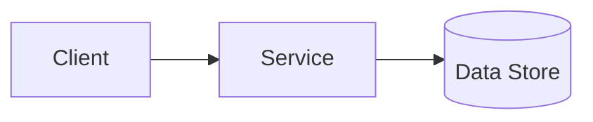

# <Title: Why X works this way>

<!--
Explanation = understanding-oriented. Provide context, mental models, tradeoffs, and rationale.
Not a procedure. Not a parameter list. Link to How-to/Reference for those.
-->

## Summary (1-2 paragraphs)

Explain:

- What problem X solves
- Why this design exists
- What the reader should understand afterward

## Context

### Problem statement

- <The original need / constraint>

### Constraints

- <Security constraints>
- <Operational constraints>
- <Cost constraints>
- <Legacy constraints>

## Concepts and mental model

### Key terms

- **<Term>:** <definition>

### How it works (high level)

Describe the main flow in words.

> **NOTE:** If a diagram helps, add it here (Mermaid allowed if your doc system supports it).

## Architecture

### Components

| Component | Responsibility | Owner | Notes |
|---|---|---|---|
| `<component>` | <responsibility> | <team> | <notes> |

### Data flow (detailed)

1. <Step>
2. <Step>

### Dependencies

- Upstream: <list>
- Downstream: <list>

## Tradeoffs and decisions

### What we optimized for

- <Reliability / simplicity / security / cost>

### What we accepted

- <Complexity / operational toil / vendor lock-in>

### Alternatives considered

| Alternative | Pros | Cons | Why not chosen |
|---|---|---|---|
| `<alt>` | <pros> | <cons> | <reason> |

## Security model

### Threats

- <Threat>

### Controls

- <Control>

### Failure impact

- <Worst case>

## Operational behavior

### Failure modes

| Failure mode | Symptoms | Detection | Mitigation |
|---|---|---|---|
| `<mode>` | <symptom> | <signal> | <mitigation> |

### Scaling and performance

- <Bottlenecks>
- <Caching>
- <Capacity planning notes>

### Backup / restore / DR

- <What's backed up, how often, RPO/RTO>

## Best Practices

These should be "principles and guardrails" derived from the explanation (not step-by-step instructions).

- <Principle 1: what to do and why>
- <Principle 2: tradeoff to remember>
- <Principle 3: default choice and when to deviate>

## FAQ

**Q:** Why not `<common alternative>`?  
**A:** <Reason tied to constraints/tradeoffs>

## Further reading

- <Link to Tutorial>
- <Link to How-to>
- <Link to Reference>
- <ADR / design doc links>

