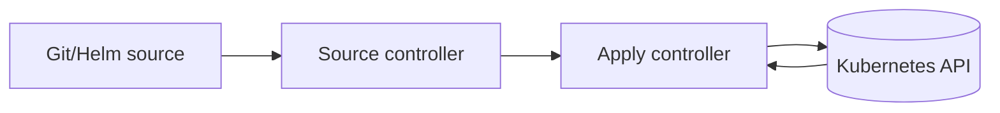

# FluxCD tutorial: first GitOps sync (bootstrap -> reconcile -> verify)

## Summary

- **Goal:** Understand FluxCD by bootstrapping it and watching a first reconciliation cycle end-to-end.
- **What you'll learn:**
  - What Flux installs in the cluster and why
  - How Flux reads your Git repo and applies Kubernetes resources
  - How to verify health and reconcile safely
  - How to debug common sync failures
- **Estimated time:** 45-90 minutes
- **Difficulty:** beginner -> intermediate
- **Who this is for:** you

## Prerequisites

### Access and permissions

- You have access to a Kubernetes cluster you can modify (sandbox preferred).
- You have a Git repository you control (or a dedicated sandbox repo).
- You can create namespaces/CRDs/controllers in the cluster (cluster-admin is typical for bootstrap).

### Required tools

- `kubectl`
- `git`
- `flux` CLI installed and in `PATH`

### Inputs you must have

- Cluster context: `<context>`
- Git repo URL: `<repo_url>`
- Git branch: `<branch>` (often `main`)
- Git path for cluster configs: `<path>` (example: `clusters/dev`)

## Safety and scope

### What this tutorial changes

- Installs Flux controllers and CRDs into the cluster (usually in `flux-system` namespace).
- Creates a Git deploy key or uses your Git provider auth depending on bootstrap method.
- Applies manifests from a repo path.

### Risks

- Bootstrapping into the wrong cluster/context can permanently change it.
- A misconfigured repo path can apply unexpected resources.

### Rollback (high-level)

- If this is a sandbox, remove Flux and applied resources (see Troubleshooting).
- If you used a deploy key, remove it from the Git provider if you uninstall Flux.

> **DANGER:** Always confirm `kubectl config current-context` before bootstrap.

## Before you start (sanity checks)

### Confirm cluster targeting

```bash
kubectl config current-context
kubectl config view --minify
kubectl get ns
```

### Confirm Flux CLI

```bash
flux --version
```

### Confirm Git access

```bash
git ls-remote <repo_url> | head
```

Checkpoint:

- You can read the repo and talk to the cluster.

## Tutorial steps

### Step 1 - Bootstrap Flux into the cluster

**What you're doing:** Install Flux controllers and point them at a Git repository.

**Why it matters:** Bootstrap establishes the GitOps control loop.

> **NOTE:** Bootstrap commands differ by Git provider (GitHub/GitLab/Bitbucket) and auth method.
> Use your org's standard method; keep secrets out of terminals and docs.

Example pattern (replace with your provider-specific command):

```bash
# Example pattern only — do not copy/paste without adapting to your provider.
flux bootstrap <git-provider> \
  --owner=<org_or_user> \
  --repository=<repo_name> \
  --branch=<branch> \
  --path=<path> \
  --context=<context>
```

Checkpoint:

- Namespace `flux-system` exists.
- Flux pods/controllers are running:

```bash
kubectl -n flux-system get pods
```

---

### Step 2 - Add a simple Kustomization target in the repo

**What you're doing:** Create a minimal set of manifests Flux can apply.

**Why it matters:** Seeing a small change reconcile makes the system click.

Create a folder at `<path>/apps/demo` with:

- `namespace.yaml` (a `Namespace`)
- `configmap.yaml` (a small `ConfigMap`)
- `kustomization.yaml` (kustomize file listing the resources)

Commit and push.

Checkpoint:

- You can point to a commit SHA that includes your demo resources.

---

### Step 3 - Tell Flux to reconcile and observe

**What you're doing:** Trigger and observe the reconcile loop: Source -> Kustomize -> apply -> health.

**Why it matters:** This is GitOps: desired state in Git converges in cluster.

List Flux objects:

```bash
flux get all -A
```

Reconcile (pattern):

```bash
flux reconcile source git flux-system
flux reconcile kustomization flux-system
```

Checkpoint:

- Flux reports reconciliation success.
- Your resources exist in cluster:

```bash
kubectl get ns | rg -n "demo" || true
kubectl get configmap -A | rg -n "demo" || true
```

---

### Step 4 - Make a change in Git and verify drift correction

**What you're doing:** Change a manifest in Git and watch Flux apply it.

**Why it matters:** This is the "single source of truth" behavior.

1. Update your `ConfigMap` value in Git.
2. Commit and push.
3. Reconcile and verify:

```bash
flux reconcile kustomization flux-system
kubectl get configmap <name> -n <namespace> -o yaml
```

Checkpoint:

- Cluster state matches Git after reconciliation.

## Cleanup (if this tutorial uses a lab)

- Remove the demo manifests from the repo and reconcile.
- If you are done with Flux in this sandbox, uninstall per your org standard.

## Troubleshooting

### Symptom: Flux controllers not running

Fix:

```bash
kubectl -n flux-system get pods
kubectl -n flux-system describe pod <pod>
kubectl -n flux-system logs <pod> --tail=200
```

### Symptom: source cannot fetch repo

Likely causes:

- Wrong repo URL/branch/path
- Git auth/deploy key not configured properly
- Network egress restrictions

Fix:

```bash
flux get sources git -A
kubectl -n flux-system describe gitrepository flux-system
```

### Error catalog (quick)

| Error / Message | Meaning | Fix |
|---|---|---|
| `AuthenticationFailed` | Git auth failed | verify deploy key/token and repo permissions |
| `path not found` | wrong `--path` or repo layout | fix path and reconcile |
| `dry-run failed` | invalid manifests | validate YAML/kustomize locally before pushing |

## Best Practices

- Treat bootstrap as a change: confirm context, document repo/path, capture evidence.
- Keep Flux definitions in Git (sources, kustomizations, helmreleases).
- Make changes by PR + review for production clusters; reconcile after merge.
- Keep reconciliation scope small (one cluster/path per kustomization is a common pattern).

## FAQ

**Q:** Is Flux applying changes immediately when I push?  
**A:** Flux polls and/or receives events depending on setup; you can always force reconciliation with `flux reconcile ...`.

## Glossary

- **GitOps:** desired state in Git reconciled to the cluster.
- **Reconcile:** controllers repeatedly converge actual state to desired state.
- **Kustomization:** Flux object that applies manifests from a source with optional health checks.

## Next steps

- How-to: `ops-scripts/documentation/02-how-to-guide/fluxcd-operate-safely.md`
- Reference: `ops-scripts/documentation/03-reference/fluxcd-reference.md`
- Explanation: `ops-scripts/documentation/04-explanation/fluxcd-how-it-works.md`

*** Add File: ops-scripts/documentation/02-how-to-guide/fluxcd-operate-safely.md
---
title: "FluxCD how-to: operate GitOps safely (reconcile, suspend, rollback, debug)"
type: "how-to"
owner: "u115478"
last_updated: "2026-04-27"
---

# FluxCD how-to: operate GitOps safely (reconcile, suspend, rollback, debug)

## Summary

- **Outcome:** Perform common FluxCD operations safely: reconcile, suspend/resume, rollback via Git, and debug failed syncs.
- **Use when:** You are responsible for a Flux-managed cluster or environment.
- **Do not use when:** Your org prohibits direct controller operations (e.g., only CI triggers) or uses another GitOps tool.
- **Time / effort:** 5-60 minutes
- **Risk level:** medium (GitOps changes can affect many resources)

## Cheat sheet

### Pre-flight

```bash
kubectl config current-context
flux check
flux get all -A
```

### Reconcile now

```bash
flux reconcile source git <name> -n <ns>
flux reconcile kustomization <name> -n <ns>
flux reconcile helmrelease <name> -n <ns>
```

### Pause/resume

```bash
flux suspend kustomization <name> -n <ns>
flux resume kustomization <name> -n <ns>
```

### Debug

```bash
flux logs --level=error --all-namespaces
kubectl -n flux-system get pods
```

## Preconditions

### Required access

- kubeconfig access to the cluster
- RBAC to read Flux resources and logs; write permissions if you will suspend/resume

### Required inputs

- Ticket/incident: `<ID>`
- Target context/cluster: `<context>`
- Affected Flux objects: `<gitrepository>`, `<kustomization>`, `<helmrelease>`

### Required tools

- `kubectl`
- `flux` CLI

## Safety

### Impact and blast radius

- **Impact:** GitOps controllers may apply/roll back changes across namespaces.
- **Blast radius:** depends on how your Kustomizations/HelmReleases are scoped.

### Preconditions for running in `prod`

- [ ] Confirm context + cluster identity
- [ ] Confirm which kustomization/helmrelease controls the affected resources
- [ ] Confirm rollback path (Git revert / prior release revision)
- [ ] Monitoring/alerting open

### Rollback plan (required)

**Rollback triggers**

- Health checks fail after a change
- Error rate/latency spikes

**Rollback steps (high-level)**

1. Revert the Git commit(s) that introduced the change.
2. Reconcile the affected kustomization/helmrelease.
3. Verify recovery.

**Rollback validation**

- Flux reports healthy and workloads are stable.

## Procedure

### 1) Identify what Flux thinks is happening

```bash
flux get all -A
flux get kustomizations -A
flux get sources git -A
flux get helmreleases -A
```

Capture:

- name/namespace of the failing object
- last applied revision (commit SHA/chart version)
- current status/error message

### 2) Reconcile safely

Prefer reconciling the smallest object that should converge the system.

```bash
flux reconcile source git <name> -n <ns>
flux reconcile kustomization <name> -n <ns>
```

If Helm-managed:

```bash
flux reconcile helmrelease <name> -n <ns>
```

### 3) Pause if you need to stop churn

If the controller is repeatedly applying a bad change, suspend it while you fix Git.

```bash
flux suspend kustomization <name> -n <ns>
```

Then fix the repo (revert or correct manifests), push, and resume:

```bash
flux resume kustomization <name> -n <ns>
flux reconcile kustomization <name> -n <ns>
```

### 4) Debug failures

Start from the status message, then look at logs:

```bash
flux logs --level=error --all-namespaces
kubectl -n flux-system get pods
kubectl -n flux-system logs deploy/<controller> --tail=200
```

Validate the rendered output (if applicable) locally in a safe environment before pushing.

## Troubleshooting

### Git source fails

```bash
flux get sources git -A
kubectl -n flux-system describe gitrepository <name>
```

Common causes:

- auth/deploy key revoked
- repo moved/renamed
- branch/path mismatch

### Kustomization apply fails

Common causes:

- invalid YAML/schema
- missing CRDs
- RBAC denies writes

Actions:

```bash
kubectl -n flux-system describe kustomization <name>
flux logs --all-namespaces --level=error
```

## Best Practices

- Roll forward/rollback via Git whenever possible; keep manual overrides to break-glass only.
- Keep Kustomizations small and scoped to a clear owner/team.
- Use health checks; require them to be green before promotion.
- Standardize naming so you can quickly map "what controls what".

## Notes / exceptions

- If you use GitOps with progressive delivery (e.g., Flagger/Argo Rollouts), treat rollbacks as an application-level concern too.

## References

- `ops-scripts/documentation/03-reference/fluxcd-reference.md`
- `ops-scripts/documentation/04-explanation/fluxcd-how-it-works.md`

*** Add File: ops-scripts/documentation/03-reference/fluxcd-reference.md
---
title: "FluxCD reference"
type: "reference"
owner: "u115478"
last_updated: "2026-04-27"
---

# FluxCD reference

## Scope

- **In scope:** common Flux objects (sources, kustomizations, helmreleases) and high-signal commands for operations.
- **Out of scope:** provider-specific bootstrap details, full CRD schemas, advanced multi-tenancy patterns.

## Cheat sheet

| Task | Command |
|---|---|
| Sanity check install | `flux check` |
| Get all Flux resources | `flux get all -A` |
| Force reconcile source | `flux reconcile source git <name> -n <ns>` |
| Force reconcile kustomization | `flux reconcile kustomization <name> -n <ns>` |
| Force reconcile helmrelease | `flux reconcile helmrelease <name> -n <ns>` |
| Suspend/resume | `flux suspend kustomization <name> -n <ns>` / `flux resume kustomization <name> -n <ns>` |
| Controller errors | `flux logs --level=error --all-namespaces` |

## Quick start (minimal)

```bash
flux get all -A
```

## Interfaces

### CLI commands

#### `flux get`

```bash
flux get sources git -A
flux get kustomizations -A
flux get helmreleases -A
```

#### `flux reconcile`

```bash
flux reconcile source git <name> -n <ns>
flux reconcile kustomization <name> -n <ns>
flux reconcile helmrelease <name> -n <ns>
```

#### `flux suspend` / `flux resume`

```bash
flux suspend kustomization <name> -n <ns>
flux resume kustomization <name> -n <ns>
```

### Configuration

#### Concepts (common CRDs)

| Object | Purpose |
|---|---|
| `GitRepository` | defines a Git source and revision polling |
| `Kustomization` | applies manifests from a source path |
| `HelmRepository` | defines a Helm chart source |
| `HelmRelease` | declares desired chart + values and reconciles it |

### Environment variables

| Name | Required | Default | Description |
|---|---:|---|---|
| `<none>` | no | n/a | (none required for basic usage) |

## Best Practices

- Keep Reference safe and scannable; link procedures to How-to docs.
- Standardize namespaces and naming for Flux objects.
- Prefer Git-driven rollback; limit `suspend/resume` to operational control.

## Security

### Authentication and authorization

- Git access is typically via deploy keys/tokens; treat them as secrets.
- RBAC should restrict who can change Flux objects in production clusters.

### Secrets handling

- Avoid committing secrets in Git; use a secret management pattern approved by your org.

## Observability

```bash
flux logs --level=error --all-namespaces
kubectl -n flux-system get pods
```

## Compatibility

- Flux behavior depends on version; keep controller versions consistent across clusters.

## Limits and known behaviors

- Flux reconciles on intervals; use `reconcile` to force convergence.

## Change log (doc)

| Date | Version | Change | Author |
|---|---|---|---|
| 2026-04-27 | 0.1.0 | Initial | u115478 |

*** Add File: ops-scripts/documentation/04-explanation/fluxcd-how-it-works.md
---
title: "FluxCD explanation: how GitOps reconciliation works"
type: "explanation"
owner: "u115478"
last_updated: "2026-04-27"
---

# FluxCD explanation: how GitOps reconciliation works

## Summary (1-2 paragraphs)

FluxCD is a set of Kubernetes controllers that continuously reconcile desired state stored in Git (and Helm chart sources) into your cluster. You declare what should exist (manifests, kustomizations, helmreleases), and Flux makes the cluster converge toward that declaration. This creates a predictable, auditable change path: the Git repo is the primary source of truth for cluster state.

The core idea is a control loop: sources fetch revisions (commits/charts), then apply controllers render/apply them, then health checks decide whether the system is "ready". If drift occurs (someone changes something manually), Flux will try to reconcile it back to Git.

## Context

### Problem statement

- Operating Kubernetes by hand does not scale and is hard to audit.
- Teams need repeatable, reviewable, and reversible changes across environments.

### Constraints

- **Security constraints:** Git credentials and cluster privileges must be protected.
- **Operational constraints:** multiple clusters/environments require consistent patterns.
- **Process constraints:** changes typically require review, promotion, and rollback.

## Concepts and mental model

### Key terms

- **Desired state:** what Git says should exist.
- **Actual state:** what is currently running in the cluster.
- **Reconciliation:** controllers converging actual -> desired repeatedly.
- **Source:** where desired state is fetched (Git repo, Helm repo).
- **Apply:** the act of creating/updating Kubernetes resources from rendered manifests.

### How it works (high level)

1. A Source controller fetches a revision (Git commit / chart version).
2. An apply controller (Kustomize/Helm) renders manifests.
3. It applies manifests to the cluster (create/update).
4. It reports status and optional health checks.
5. On next interval (or on-demand reconcile), repeats to ensure convergence.



## Architecture

### Components

| Component | Responsibility | Owner | Notes |
|---|---|---|---|
| Source controllers | fetch revisions | platform | GitRepository/HelmRepository |
| Apply controllers | render + apply | platform | Kustomization/HelmRelease |
| Kubernetes API | stores state | platform | admission controls still apply |
| Git repo | change history | org/team | reviewable and auditable |

### Dependencies

- Upstream: Git provider availability, network egress, auth tokens/keys.
- Downstream: cluster health, RBAC, CRDs, admission policies.

## Tradeoffs and decisions

### What we optimized for

- Auditability (Git history)
- Repeatability (same inputs produce same outputs)
- Drift correction (convergence over time)

### What we accepted

- Controllers add complexity and another "layer" to debug.
- Mis-scoped reconciliations can have large blast radius.

### Alternatives considered

| Alternative | Pros | Cons | Why not chosen |
|---|---|---|---|
| imperative ops | simple for small scale | not auditable, inconsistent | does not scale |
| CI-only apply | familiar | weaker drift correction | depends on workflows |

## Security model

### Threats

- Git credentials compromise leads to cluster compromise.
- Over-broad cluster-admin permissions increase blast radius.

### Controls

- Least privilege RBAC for Flux controllers and operators.
- Protect Git branches with review and required checks.
- Avoid storing secrets in plaintext Git; use an approved secret pattern.

## Operational behavior

### Failure modes

| Failure mode | Symptoms | Detection | Mitigation |
|---|---|---|---|
| Git fetch fails | source not ready | Source status + logs | fix auth/network |
| apply fails | kustomization/helmrelease not ready | status + controller logs | fix manifests/CRDs |
| drift | resources keep changing back | diff between manual changes and Git | enforce Git-only changes |

### Backup / restore / DR

- Git is the primary backup for declarative state; restoration is re-bootstrap + reconcile.

## Best Practices

- Keep "what controls what" clear: small, scoped Kustomizations/HelmReleases.
- Use promotion patterns (dev -> stage -> prod) with review gates.
- Prefer rollback by Git revert and reconcile.
- Document ownership boundaries (teams/namespaces) to reduce blast radius.

## FAQ

**Q:** Does Flux apply everything in the repo?  
**A:** No. Flux applies what your Kustomizations/HelmReleases point to (sources + paths), not arbitrary repo content.

## Further reading

- Tutorial: `ops-scripts/documentation/01-tutorial/fluxcd-getting-started.md`
- How-to: `ops-scripts/documentation/02-how-to-guide/fluxcd-operate-safely.md`
- Reference: `ops-scripts/documentation/03-reference/fluxcd-reference.md`

