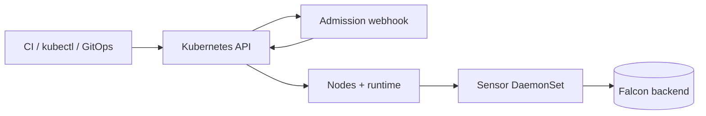

# CrowdStrike Falcon on Kubernetes explanation: admission control and node runtime sensors

## Summary (1-2 paragraphs)

CrowdStrike Falcon on Kubernetes typically combines two complementary controls: an admission controller (a Kubernetes webhook that can validate or mutate workload objects at create/update time) and a runtime sensor (a node-level agent, often deployed as a DaemonSet) that observes runtime behavior for threat detection. Admission is about preventing or shaping what gets deployed; runtime sensors are about detecting and responding to behavior after workloads run.

The most important mental model is "where the control happens": admission runs on the Kubernetes API request path and can block or modify objects; sensors run on nodes and interact with the container runtime/kernel, which can impact stability if misconfigured. Both require careful scoping, staged rollout, and explicit rollback plans.

## Context

### Problem statement

- Clusters need consistent security enforcement at deploy time (policy) and runtime (detection).
- Teams need visibility and coverage across heterogeneous node pools and namespaces.

### Constraints

- **Security constraints:** admission decisions are cluster-critical; sensors may require elevated privileges.
- **Operational constraints:** misconfigurations can impact scheduling, API latency, or node stability.
- **Process constraints:** changes should be auditable and ideally managed via GitOps.

## Concepts and mental model

### Key terms

- **Admission webhook:** server-side hook invoked by the API server for certain requests.
- **Mutating webhook:** can modify objects (e.g., inject sidecars).
- **Validating webhook:** can allow/deny based on policy.
- **Failure policy:** what happens if the webhook cannot be reached (fail-open vs fail-closed).
- **DaemonSet:** ensures a Pod runs on each node (or matching nodes).

### How it works (high level)

1. Operator/CI submits a workload to the Kubernetes API.
2. Admission webhooks are called; they may mutate/validate/deny.
3. If allowed, controllers schedule and run Pods on nodes.
4. Runtime sensors on nodes observe workload behavior and report telemetry to Falcon backend.

## Architecture

### Components

| Component | Responsibility | Owner | Notes |
|---|---|---|---|
| admission controller | validate/mutate at API time | platform/security | cluster-critical path |
| webhook config | scope + failure behavior | platform/security | `namespaceSelector` and `failurePolicy` matter |
| sensor DaemonSet | node runtime telemetry | platform/security | can be privileged |
| Falcon backend | analytics + policy + telemetry | vendor | external dependency |

### Dependencies

- Upstream: API server performance, DNS/service discovery to reach webhook service.
- Downstream: node OS/arch compatibility, container runtime behavior, network egress to Falcon backend.

## Tradeoffs and decisions

### What we optimized for

- Preventing risky deployments (admission) plus detecting runtime threats (sensor).
- Centralized policy and consistent coverage.

### What we accepted

- Added complexity and critical-path components (admission).
- Potential performance/stability impact on nodes (sensor).

### Alternatives considered

| Alternative | Pros | Cons | Why not chosen |
|---|---|---|---|
| policy-only (OPA/Kyverno) | K8s-native | no runtime detection | limited to deploy-time |
| runtime-only | minimal API impact | no deploy-time enforcement | misses prevention controls |

## Security model

### Threats

- Mis-scoped admission blocks critical workloads.
- Fail-closed webhooks create outages if the controller is unavailable.
- Over-privileged sensors expand attack surface.

### Controls

- Stage admission rollouts with limited namespace selectors.
- Start fail-open until stable; move to fail-closed only intentionally.
- Use canary node pools for sensor rollout and explicit resource limits.

## Operational behavior

### Failure modes

| Failure mode | Symptoms | Detection | Mitigation |
|---|---|---|---|
| webhook unreachable | create/update fails or latency | API errors/events | fail-open or rollback; fix service/DNS |
| policy too strict | denials spike | events + webhook logs | adjust scope/policy; observe mode |
| sensor instability | node pressure/crashloops | node metrics + DS status | rollback sensor; adjust resources/compat |

### Backup / restore / DR

- Keep config (values/manifests) in Git; treat rollback as revert + redeploy.
- Have break-glass steps to disable/remove webhook configs if needed.

## Best Practices

These are principles and guardrails (not a procedure).

- Treat admission changes as high-risk: stage scope, validate, then expand.
- Prefer GitOps for reproducibility and auditability.
- Separate responsibilities: platform owns stability; security owns policy intent; app teams own exemptions.
- Monitor for denial spikes and node pressure as first-class incident signals.

## FAQ

**Q:** Why is admission riskier than a DaemonSet?  
**A:** Admission sits on the API request path and can block creates/updates cluster-wide; DaemonSets typically fail per-node/pool.

## Further reading

- How-to: `ops-scripts/documentation/02-how-to-guide/crowdstrike-falcon-admission-controller-implement.md`
- How-to: `ops-scripts/documentation/02-how-to-guide/crowdstrike-falcon-sensor-daemonset-deploy.md`
- Reference: `ops-scripts/documentation/03-reference/crowdstrike-falcon-k8s-reference.md`

