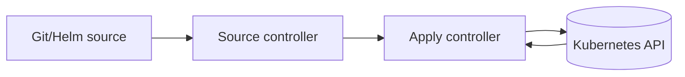

# FluxCD explanation: how GitOps reconciliation works

## Summary (1-2 paragraphs)

FluxCD is a set of Kubernetes controllers that continuously reconcile desired state stored in Git (and Helm chart sources) into your cluster. You declare what should exist (manifests, kustomizations, helmreleases), and Flux makes the cluster converge toward that declaration. This creates a predictable, auditable change path: the Git repo is the primary source of truth for cluster state.

The core idea is a control loop: sources fetch revisions (commits/charts), then apply controllers render/apply them, then health checks decide whether the system is "ready". If drift occurs (someone changes something manually), Flux will try to reconcile it back to Git.

## Context

### Problem statement

- Operating Kubernetes by hand does not scale and is hard to audit.
- Teams need repeatable, reviewable, and reversible changes across environments.

### Constraints

- **Security constraints:** Git credentials and cluster privileges must be protected.
- **Operational constraints:** multiple clusters/environments require consistent patterns.
- **Process constraints:** changes typically require review, promotion, and rollback.

## Concepts and mental model

### Key terms

- **Desired state:** what Git says should exist.
- **Actual state:** what is currently running in the cluster.
- **Reconciliation:** controllers converging actual -> desired repeatedly.
- **Source:** where desired state is fetched (Git repo, Helm repo).
- **Apply:** creating/updating Kubernetes resources from rendered manifests.

### How it works (high level)

1. A Source controller fetches a revision (Git commit / chart version).
2. An apply controller (Kustomize/Helm) renders manifests.
3. It applies manifests to the cluster (create/update).
4. It reports status and optional health checks.
5. On next interval (or on-demand reconcile), repeats to ensure convergence.

## Architecture

### Components

| Component | Responsibility | Owner | Notes |
|---|---|---|---|
| Source controllers | fetch revisions | platform | GitRepository/HelmRepository |
| Apply controllers | render + apply | platform | Kustomization/HelmRelease |
| Kubernetes API | stores state | platform | admission policies still apply |
| Git repo | change history | org/team | reviewable and auditable |

### Dependencies

- Upstream: Git provider availability, network egress, auth tokens/keys.
- Downstream: cluster health, RBAC, CRDs, admission policies.

## Tradeoffs and decisions

### What we optimized for

- Auditability (Git history)
- Repeatability (same inputs produce same outputs)
- Drift correction (convergence over time)

### What we accepted

- Controllers add complexity and another layer to debug.
- Mis-scoped reconciliations can have large blast radius.

### Alternatives considered

| Alternative | Pros | Cons | Why not chosen |
|---|---|---|---|
| imperative ops | simple for small scale | not auditable, inconsistent | does not scale |
| CI-only apply | familiar | weaker drift correction | depends on workflows |

## Security model

### Threats

- Git credentials compromise leads to cluster compromise.
- Over-broad privileges increase blast radius.

### Controls

- Least privilege RBAC for Flux controllers and operators.
- Protect Git branches with review and required checks.
- Avoid storing secrets in plaintext Git; use an approved secret management pattern.

## Operational behavior

### Failure modes

| Failure mode | Symptoms | Detection | Mitigation |
|---|---|---|---|
| Git fetch fails | source not ready | Source status + logs | fix auth/network |
| apply fails | kustomization/helmrelease not ready | status + logs | fix manifests/CRDs |
| drift | resources revert | changes keep rolling back | enforce Git-only changes |

### Backup / restore / DR

- Git is the primary backup for declarative state; restoration is re-bootstrap + reconcile.

## Best Practices

- Keep "what controls what" clear: small, scoped Kustomizations/HelmReleases.
- Use promotion patterns (dev -> stage -> prod) with review gates.
- Prefer rollback by Git revert and reconcile.
- Document ownership boundaries (teams/namespaces) to reduce blast radius.

## FAQ

**Q:** Does Flux apply everything in the repo?  
**A:** No. Flux applies what your Kustomizations/HelmReleases point to (sources + paths), not arbitrary repo content.

## Further reading

- Tutorial: `ops-scripts/documentation/01-tutorial/fluxcd-getting-started.md`
- How-to: `ops-scripts/documentation/02-how-to-guide/fluxcd-operate-safely.md`
- Reference: `ops-scripts/documentation/03-reference/fluxcd-reference.md`

