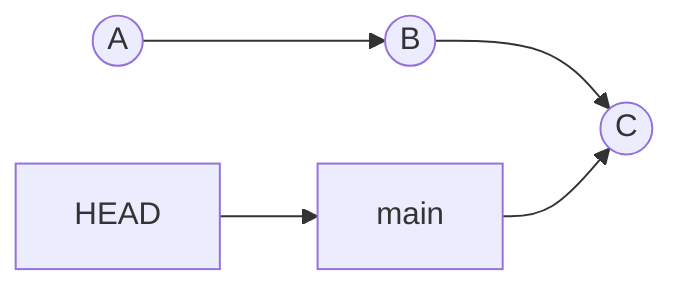
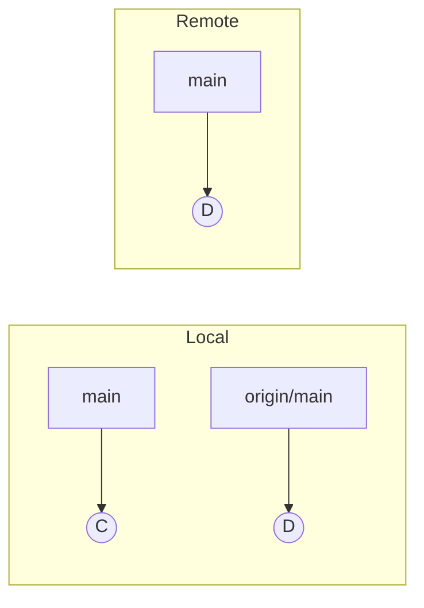

# git explanation: mental model (commits, branches, HEAD, index, remotes)

## Summary (1-2 paragraphs)

Git is a content-addressed database of commits. Each commit is a snapshot of your project plus links to its parent commit(s), forming a history graph. Most Git commands are about (1) moving names (branches/tags) to point at different commits, and (2) updating your working tree to match the commit you selected.

Most beginner confusion comes from not separating the three places your changes can live: the working tree (files), the index (staging area), and the repository (commits). Once you can place a change into one of these three areas, commands like `add`, `commit`, `restore`, `reset`, and `revert` become predictable.

## Context

### Problem statement

- You need a simple model to predict what Git will do before you run a command.
- You want to undo mistakes without losing work or breaking shared branches.

### Constraints

- Git history is a graph: merges create commits with multiple parents.
- Teams share history through remotes; rewriting shared history can break others.

## Concepts and mental model

### The three "trees"

- **Working tree:** your files on disk (edited in your editor).
- **Index (staging area):** the exact contents of the *next commit*.
- **Repository (HEAD/commits):** the commits you have recorded.

Typical flow:

1. Edit files (working tree changes)
2. `git add ...` (copy selected changes into the index)
3. `git commit` (write a commit from the index)

### Commits, branches, and HEAD

- A **commit** points to its parent(s). Think "linked snapshots".
- A **branch** is just a name that points to a commit.
- **HEAD** is where you are "checked out" (usually a branch name).

When you commit on `main`, Git creates a new commit and moves `main` forward.

### Remotes and remote-tracking branches

- A **remote** (often `origin`) is a named pointer to another repo.
- `git fetch` downloads new commits and updates *remote-tracking branches* (like `origin/main`).
- Your local `main` does not move on `fetch`; it moves on `merge`, `rebase`, or `pull`.

`git pull` is roughly: `git fetch` + integrate (`merge` or `rebase`) into your current branch.

### Undo operations: restore vs reset vs revert

Think of "what moves" and "where changes go":

- `git restore <path>`: moves *files* (working tree and/or index) back toward a commit.
- `git reset <target>`: moves a *branch name* (and optionally index/working tree) back to a commit.
- `git revert <sha>`: creates a *new commit* that undoes a previous commit (shared-safe).

Practical rule:

- If the commit is already shared, prefer `revert`.
- If it's local-only, `reset` can be fine.

## Tradeoffs and decisions

- Git gives you powerful local history editing, but the cost is that rewriting shared history can break collaborators.
- Teams often adopt policies: "no force-push to main", "feature branches can be rebased", etc.

## Related docs

- Learn by doing: `documentation/01-tutorial/git-getting-started.md`
- Undo safely: `documentation/02-how-to-guide/git-undo-changes-safely.md`
- Command lookup: `documentation/03-reference/git-reference.md`

