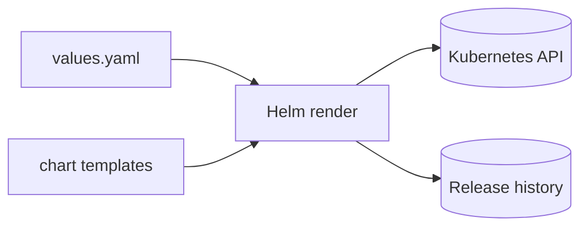

# Helm explanation: charts, releases, rendering, and rollback

## Summary (1-2 paragraphs)

Helm is a package manager and templating tool for Kubernetes. A chart is a parameterized set of Kubernetes manifests. When you install a chart, Helm renders templates using values to produce plain YAML and applies it to the cluster, creating a named release with revision history. That history enables upgrade and rollback workflows without manually tracking every changed object.

The key mental model is: Helm is not a controller by itself (unless combined with a controller like Flux). Helm runs on your workstation/CI, renders YAML, and talks to the Kubernetes API. The cluster is still the authority for admission, RBAC, and whether resources become ready.

## Context

### Problem statement

- Raw YAML becomes hard to manage across environments due to duplication and configuration differences.
- Teams need a consistent way to version and promote deployments.

### Constraints

- **Security constraints:** values may contain secrets; charts may create cluster-scoped resources.
- **Operational constraints:** upgrades must be reversible and observable.
- **Process constraints:** Git review and promotion are typically required for production changes.

## Concepts and mental model

### Key terms

- **Chart:** a package of templates and defaults.
- **Values:** configuration input used to render templates.
- **Release:** an installed chart instance with a name and revisions.
- **Revision:** a recorded release version after an install/upgrade/rollback.

### How it works (high level)

1. Helm reads chart templates and values.
2. Helm renders templates into Kubernetes manifests.
3. Helm sends manifests to the Kubernetes API (create/update).
4. Helm records release metadata and revision history.
5. Rollback re-applies a prior revision's manifests.

## Architecture

### Components

| Component | Responsibility | Owner | Notes |
|---|---|---|---|
| Helm CLI | render + apply + track revisions | operator/CI | not a long-running controller |
| Kubernetes API | validates and persists objects | platform | RBAC/admission apply |
| release history | records revisions | platform/namespace | used for rollback |

### Dependencies

- Upstream: chart repo availability, network access to cluster.
- Downstream: admission policies, CRDs, RBAC, cluster health.

## Tradeoffs and decisions

### What we optimized for

- Reuse and parameterization across environments.
- Upgrade/rollback semantics with revision history.

### What we accepted

- Templates add complexity and can hide what will actually be applied.
- Charts vary in quality; you must review the rendered output.

### Alternatives considered

| Alternative | Pros | Cons | Why not chosen |
|---|---|---|---|
| raw YAML | explicit | duplication across envs | hard to maintain |
| Kustomize-only | patch-based | limited parameterization | depends on use case |

## Security model

### Threats

- Values containing secrets leak via repos, logs, or CI artifacts.
- Charts install cluster-scoped resources unexpectedly.

### Controls

- Review rendered output (`helm template`, `helm diff`) before apply.
- Keep values minimal; handle secrets via an approved mechanism.
- Pin chart versions and verify provenance per org policy.

## Operational behavior

### Failure modes

| Failure mode | Symptoms | Detection | Mitigation |
|---|---|---|---|
| bad values | pods fail, wrong config | events/logs | revert values + upgrade/rollback |
| immutable changes | upgrade fails | API error | chart-specific recreate/strategy |
| missing CRDs | resources rejected | API errors | install CRDs first (per policy) |

### Backup / restore / DR

- Releases are re-creatable from chart + values stored in Git; treat those as the backup.

## Best Practices

These are principles and guardrails (not a procedure).

- Prefer "preview then apply" workflows.
- Pin chart versions and promote them across environments deliberately.
- Use GitOps to make releases declarative when operating at scale.
- Treat chart upgrades like code upgrades: review, test, rollback plan.

## FAQ

**Q:** Does Helm continuously enforce state like Flux?  
**A:** No. Helm runs when you execute it. Continuous reconciliation requires a controller (Flux/Argo CD, etc.).

## Further reading

- Tutorial: `ops-scripts/documentation/01-tutorial/helm-getting-started.md`
- How-to: `ops-scripts/documentation/02-how-to-guide/helm-operate-releases-safely.md`
- Reference: `ops-scripts/documentation/03-reference/helm-reference.md`

