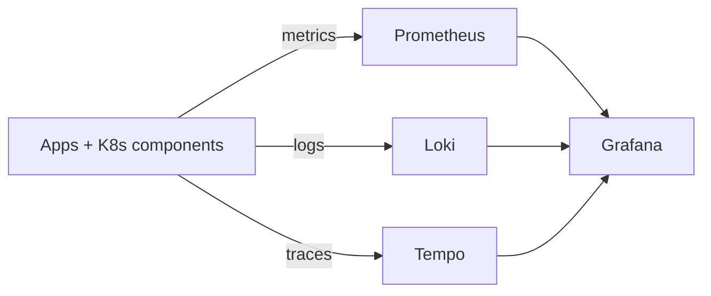

# Kubernetes observability explanation: how metrics, logs, and traces flow (Prometheus, Loki, Tempo, Grafana)

## Summary (1-2 paragraphs)

An observability stack turns raw runtime signals into questions you can answer quickly. Metrics (Prometheus) summarize numeric behavior over time, logs (Loki) provide discrete events and error context, and traces (Tempo) show end-to-end request paths and latency breakdown. Grafana sits on top to query, correlate, and visualize these signals with consistent metadata.

The most important mental model is "pipeline + metadata": each signal has an ingestion pipeline and a metadata scheme (labels/attributes). If metadata is inconsistent (e.g., service naming differs across metrics/logs/traces), correlation becomes slow. If cardinality is uncontrolled (too many unique label values), performance and cost become the limiting factors.

## Context

### Problem statement

- Kubernetes is dynamic; manual debugging doesn't scale.
- Teams need consistent visibility across nodes, workloads, and services.

### Constraints

- **Security constraints:** observability data may contain sensitive info (names, IDs, sometimes payloads if mislogged).
- **Operational constraints:** storage and ingestion must be sized and controlled.
- **Process constraints:** alerts must have owners; dashboards need maintenance.

## Concepts and mental model

### Key terms

- **Metric:** numeric time series (counter/gauge/histogram).
- **Log:** timestamped event text with labels.
- **Trace:** collection of spans for a request/transaction.
- **Label/cardinality:** key/value tags; cardinality is number of unique series.
- **Datasource:** backend queried by Grafana (Prometheus/Loki/Tempo).

### How it works (high level)

1. Workloads and platforms emit metrics/logs/traces (or agents collect them).
2. Backends ingest and store signals.
3. Grafana queries backends and correlates by labels/attributes and time.

## Architecture

### Components

| Component | Responsibility | Owner | Notes |
|---|---|---|---|
| Prometheus | scrape + store metrics | platform | pull-based scrape model |
| Loki | ingest + store logs | platform | label-based indexing |
| Tempo | ingest + store traces | platform | trace search depends on config |
| Grafana | query + dashboards + alerts | platform/teams | central UI |
| agents/collectors | collect/ship signals | platform | DaemonSets/sidecars/collectors |

### Data flow (detailed)

#### Metrics (Prometheus)

- Prometheus scrapes endpoints (pull) on an interval.
- Each unique label set creates a time series.
- Alert rules evaluate queries over time windows.

#### Logs (Loki)

- Node agents collect container logs and attach labels (namespace/pod/container).
- Loki indexes labels (not full text) and stores log lines in chunks.

#### Traces (Tempo)

- Apps export spans (often via OpenTelemetry).
- Collector batches and exports to Tempo.
- Trace search relies on trace IDs and configured attributes; full-text indexing is not default.

## Tradeoffs and decisions

### What we optimized for

- Fast "is it broken?" detection (metrics)
- Fast "why?" inspection (logs)
- Fast "where?" analysis (traces)

### What we accepted

- Storage and ingestion must be managed; uncontrolled signals create cost/perf problems.
- Without conventions, correlation is hard.

### Alternatives considered

| Alternative | Pros | Cons | Why not chosen |
|---|---|---|---|
| logs-only | detailed | poor trending/alerting | lacks numeric rollups |
| metrics-only | cheap-ish and fast | weak root cause | missing context |

## Security model

### Threats

- Leaking secrets/PII into logs and traces.
- Over-broad access to cluster-wide observability data.
- Cardinality attacks (intentional or accidental) causing resource exhaustion.

### Controls

- Redact at source; avoid logging secrets and sensitive payloads.
- Enforce label conventions and maximum cardinality patterns.
- Restrict access by team/namespace if required.

## Operational behavior

### Failure modes

| Failure mode | Symptoms | Detection | Mitigation |
|---|---|---|---|
| scrape breaks | missing metrics | targets down | fix ServiceMonitors/RBAC |
| log agent down | missing logs | DaemonSet not ready | fix node selectors/tolerations |
| traces missing | no traces | no exporter/instrumentation | deploy collector + instrument apps |
| overload | slow queries | high CPU/disk | reduce cardinality, adjust retention, scale backends |

### Backup / restore / DR

- Treat dashboards/alerts/config as code (Git). For data, define retention rather than "backup everything".

## Best Practices

These are principles and guardrails (not a procedure).

- Define naming/label conventions early and enforce them.
- Keep cardinality controlled; high-cardinality labels are the fastest path to pain.
- Treat observability data as sensitive and apply least privilege.
- Align alerts with ownership and on-call; reduce alert fatigue by design.

## FAQ

**Q:** Why is my PromQL query slow?  
**A:** Usually high cardinality or wide time ranges; narrow labels/time windows and avoid unbounded aggregation.

## Further reading

- Tutorial: `ops-scripts/documentation/01-tutorial/k8s-observability-getting-started.md`
- How-to: `ops-scripts/documentation/02-how-to-guide/k8s-observability-operate-stack.md`
- Reference: `ops-scripts/documentation/03-reference/k8s-observability-reference.md`

