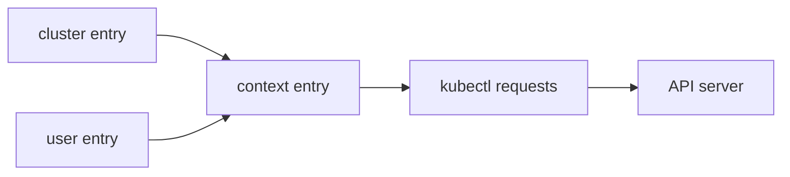

# kubeconfig explanation: contexts, clusters, users, namespaces (mental model)

## Summary (1-2 paragraphs)

`kubectl` chooses a target using your kubeconfig. A kubeconfig file is a set of named entries: **clusters** (API server endpoints + CA), **users** (credentials), and **contexts** (a named combination of cluster + user + default namespace). When you run `kubectl`, it picks the current context (unless you override it) and sends API requests to that cluster as that user.

Most kubectl accidents happen because the operator thinks they are targeting one cluster/namespace but their context points somewhere else. The fix is to treat context selection as a required pre-flight check and to pin `--context` and `-n` in scripts and high-risk commands.

## Context

### Problem statement

- You need to work across dev/stage/prod clusters safely.
- You need a reliable way to answer: "What cluster am I about to change?"

### Constraints

- Kubeconfig can be merged from multiple files; names can collide.
- Credentials can be static (certs/tokens) or dynamic (exec plugins, cloud auth).

## Concepts and mental model

### Where contexts come from (in practice)

Contexts are not "discovered" by kubectl. They exist because something wrote them into kubeconfig:

- **Cluster tooling** writes kubeconfig entries (example: kind creates `kind-<name>`).
- **Cloud CLIs** write/merge kubeconfig entries after you authenticate (EKS/AKS/GKE, etc.).
- **Admins** distribute kubeconfig files for a cluster/user (common for lab/bare-metal).

`kubectl` then uses those static entries (plus any dynamic credential plugins referenced by the `user` entry).

### The building blocks

- **cluster:** where the API server is (`server: https://...`) + trust chain
- **user:** how you authenticate (token/cert/exec plugin)
- **context:** a friendly name that ties `cluster + user + namespace`
- **current-context:** the active context `kubectl` will use by default



### What `--context` and `-n` do

- `--context <ctx>` overrides current-context for that one command.
- `-n <ns>` overrides namespace for that one command.
- `kubectl config set-context --current --namespace=<ns>` sets a *default namespace* for the context (persistent in kubeconfig).

### Why `kubectl config view --minify` matters

`--minify` shows the *effective* config for the current context (or a pinned context if you also pass `--context`).

Practical pattern:

```bash
kubectl --context <ctx> config view --minify
kubectl --context <ctx> -n <ns> get pods
```

### Multi-file kubeconfig

Kubeconfig sources, highest priority first:

1. `--kubeconfig <path>`
2. `KUBECONFIG` (a list of files)
3. `~/.kube/config`

When multiple files are used, entries are merged. This is convenient, but can also create ambiguity if two files define the same context name.

### Multiple clusters in one `~/.kube/config`

It is normal for a single kubeconfig file to contain multiple clusters.

Conceptually, kubeconfig is three named lists:

- `clusters[]`: API server endpoints + trust (CA)
- `users[]`: credentials (token/cert/exec plugin)
- `contexts[]`: links one cluster + one user + (optionally) a default namespace

That means you can have:

- many clusters (dev/stage/prod, multiple regions, local kind, etc.)
- many users (different identities/roles)
- many contexts that combine them in safe, readable ways

`kubectl` targets exactly one context at a time:

- default: `current-context`
- per-command override: `kubectl --context <ctx> ...`

Practical inspection commands:

```bash
kubectl config get-contexts
kubectl config current-context
kubectl config view --minify
```

### Creating a context vs creating credentials

It helps to separate two actions:

- **Creating a context name**: `kubectl config set-context ...` links a cluster + user + namespace.
- **Creating credentials**: happens outside kubectl (tokens, certs, exec plugins, cloud login).

If you create a context manually but the `user` entry has no valid credentials, commands will fail with auth errors even though the context exists.

## Tradeoffs and decisions

- Convenience vs safety: a single merged kubeconfig is easy, but context naming and pre-flight checks become critical.
- Local defaults vs explicit flags: setting default namespace reduces typing but can hide intent; scripts should prefer explicit `--context` and `-n`.

## Related docs

- Manage contexts safely: `documentation/02-how-to-guide/kubectl-manage-contexts-namespaces.md`
- kubectl commands: `documentation/03-reference/kubectl-reference.md`
