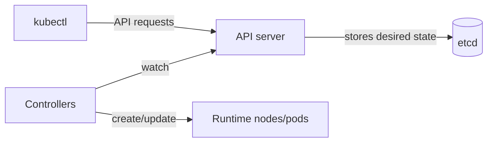

# kubectl explanation: mental model (contexts, desired state, controllers)

## Summary (1-2 paragraphs)

`kubectl` is a client for the Kubernetes API. It does not "do work" on the cluster by itself; it sends requests to the API server, which stores desired state and coordinates controllers to make that state real. Understanding this separation helps you reason about why commands sometimes appear to "succeed" while the system still converges (or fails to converge) in the background.

Most kubectl mistakes come from two gaps: (1) targeting the wrong cluster/namespace because of context confusion, and (2) expecting imperative "do this now" semantics in a system built around desired state and reconciliation. This document gives you a mental model so you can predict outcomes and choose safer workflows.

## Context

### Problem statement

- You need a consistent way to inspect and change Kubernetes resources across environments.
- You need safety rails so changes go to the correct cluster/namespace and are auditable.

### Constraints

- **Security constraints:** auth and authorization are enforced server-side (RBAC); the client is not trusted by default.
- **Operational constraints:** multiple clusters, multiple namespaces, and multiple terminals increase risk.
- **Process constraints:** many orgs require GitOps or change management, limiting direct kubectl writes.

## Concepts and mental model

### Key terms

- **API server:** the front door for reads/writes to the cluster state.
- **resource:** a typed object in the API (Pod, Deployment, Service, etc.).
- **namespace:** a scope boundary for many resource types.
- **context:** a named selection of cluster + user + namespace in kubeconfig.
- **controller:** a control loop that reconciles desired state to actual state.
- **reconciliation:** the continuous process of converging toward desired state.

### How it works (high level)

1. `kubectl` reads your kubeconfig to pick a **context** (cluster + user + namespace).
2. `kubectl` sends API requests to the cluster's API server.
3. The API server stores objects (desired state) and validates auth/RBAC and schema.
4. Controllers observe changes and act to make actual state match desired state.

## Architecture

### Components

| Component | Responsibility | Owner | Notes |
|---|---|---|---|
| kubeconfig | targets and credentials | workstation user | context selection is a primary safety concern |
| API server | auth + validation + persistence | cluster platform | the source of truth for objects |
| etcd | stores cluster objects | cluster platform | not directly touched by kubectl normally |
| controllers | reconcile desired -> actual | cluster platform | e.g., Deployment controller, ReplicaSet controller |

### Data flow (detailed)

1. You run `kubectl apply -f deploy.yaml`.
2. The API server validates request + stores the updated Deployment spec.
3. Deployment controller creates/updates ReplicaSets.
4. Scheduler assigns Pods to nodes.
5. Kubelet pulls images and starts containers.
6. Health checks and readiness gates determine when traffic is sent.

### Dependencies

- Upstream: identity provider/cloud auth plugins, network access to API server, DNS.
- Downstream: nodes, CNI, container runtime, storage, admission policies.

## Tradeoffs and decisions

### What we optimized for

- Declarative management: apply a desired state and let controllers reconcile.
- Continuous healing: controllers re-create missing components.

### What we accepted

- Changes are not always immediate; the system converges over time.
- Debugging requires correlating multiple signals (events, logs, status fields).

### Alternatives considered

| Alternative | Pros | Cons | Why not chosen |
|---|---|---|---|
| purely imperative orchestration | straightforward mental model | brittle, no reconciliation | Kubernetes is built for declarative reconciliation |
| direct node management | familiar for server admins | does not scale, inconsistent | breaks desired state assumptions |

## Security model

### Threats

- Accidental changes in the wrong cluster/namespace.
- Over-broad RBAC permissions leading to high blast radius.
- Credential leakage from kubeconfig, terminals, or logs.

### Controls

- Use least privilege RBAC and namespace scoping.
- Prefer audited workflows (manifests in Git, `diff` before `apply`).
- Treat kubeconfig as sensitive (it may contain tokens/certs).

### Failure impact

- A "correct" command can still cause an outage if it targets the wrong context.
- A "successful" API write can still result in failing workloads if the cluster cannot reconcile.

## Operational behavior

### Failure modes

| Failure mode | Symptoms | Detection | Mitigation |
|---|---|---|---|
| wrong context | unexpected resources change | `kubectl config view --minify` | require explicit context; use guardrails |
| wrong namespace | "not found" or wrong workload | `kubectl get ns` / `-n` | set namespace in context; use explicit `-n` |
| rollout failure | pods crashloop or stuck | `kubectl rollout status`, events | inspect `describe`, logs, revert/undo |
| RBAC deny | `Forbidden` | `kubectl auth can-i` | request proper role; reduce scope |

### Scaling and performance

- `kubectl` is often the fastest signal path, but it only shows what the API server knows.
- For performance issues, combine kubectl status with metrics and traces.

### Backup / restore / DR

- Treat manifests and configuration as the primary backup (Git).
- For data, use storage-layer backups; kubectl is not a backup system.

## Best Practices

These are principles and guardrails (not a procedure).

- Prefer declarative changes (manifests) over ad-hoc imperative edits.
- Make targeting explicit: context + namespace + resource type/name in notes and commands.
- Assume reconciliation: after a change, verify with rollout status, events, and metrics.
- Keep RBAC least-privilege; avoid cluster-admin for routine work.

## FAQ

**Q:** Why does `kubectl apply` return success but the app is still broken?  
**A:** The API write succeeded, but controllers may be failing to reconcile (image pull, scheduling, readiness, policy, or runtime issues).

**Q:** Why do Pods come back after I delete them?  
**A:** A controller (Deployment/ReplicaSet/StatefulSet) is reconciling desired state and recreates them.

## Further reading

- Tutorial: `ops-scripts/documentation/01-tutorial/kubectl-getting-started.md`
- How-to: `ops-scripts/documentation/02-how-to-guide/kubectl-operate-workloads-safely.md`
- Reference: `ops-scripts/documentation/03-reference/kubectl-reference.md`

