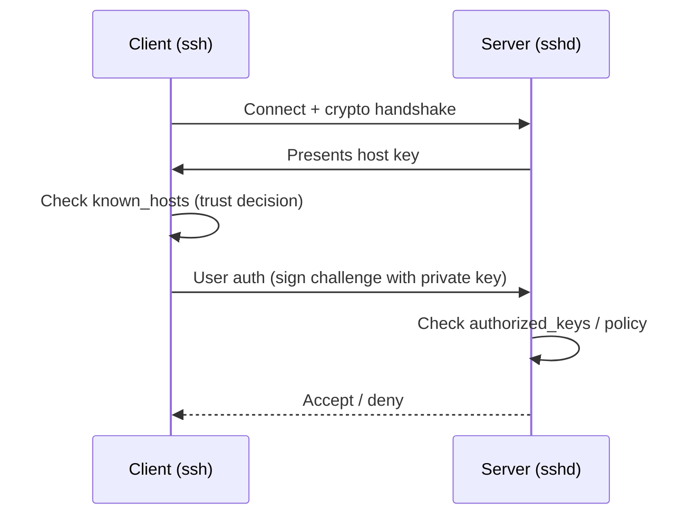

# How SSH authentication and trust works (keys, host keys, agents)

## Summary (1–2 paragraphs)

SSH solves two problems at the same time: (1) creating an encrypted channel over an untrusted network, and (2) verifying identities on both ends so you connect to the right server and the server can decide whether to allow you in. In practice, most day-to-day SSH confusion comes from mixing up *user keys* (your identity) with *host keys* (the server’s identity), or from not realizing that SSH caches trust decisions (like host keys) for safety.

After reading this, you should understand the lifecycle of SSH trust: how a client decides “this is the same server as last time”, how a server decides “this user is allowed”, why agents exist, and where the sharp edges are (forwarding, lockout risks, and key sprawl).

## Context

### Problem statement

- Encrypt traffic between client and server so credentials and data are not exposed.
- Prevent impostor servers (man-in-the-middle) and unauthorized users.
- Make access manageable across many machines without sharing passwords.

### Constraints

- **Security:** keys must be protected; auth must be auditable and revocable.
- **Operations:** access must not be fragile; changes must be roll-backable.
- **Legacy:** some environments require older algorithms or constraints.

## Concepts and mental model

### Key terms

- **Client:** your workstation (runs `ssh`).
- **Server:** the machine running `sshd`.
- **User key pair:** your private key (kept secret) + public key (shared).
- **Host key pair:** the server’s private/public identity keys.
- **Known hosts:** your local cache of server host keys.
- **Authorized keys:** the server’s list of allowed user public keys.
- **Agent:** a local process that holds decrypted keys in memory.

### How it works (high level)

1. **Handshake & encryption:** client and server negotiate encryption and establish a secure channel.
2. **Server identity check (host key):** client verifies the server’s host key against `known_hosts`.
3. **User authentication (user key):** client proves possession of a private key; server checks it matches an authorized public key.
4. **Session established:** commands, shells, and forwarding happen over the encrypted channel.

## Architecture

### Components

| Component | Responsibility | Owner | Notes |
|---|---|---|---|
| `ssh` | client app | workstation user | uses `~/.ssh/config` and keys |
| `sshd` | server daemon | host owner | uses `sshd_config` and host keys |
| `known_hosts` | server trust cache | workstation user | prevents silent MITM |
| `authorized_keys` | access allowlist | host owner | grants user key access |
| agent | key convenience | workstation user | reduces passphrase prompts |

### Data flow (detailed)

1. Client connects to `<host>:<port>`.
2. Server proves its identity with its **host key**.
3. Client compares that host key with prior saved value in `known_hosts`.
4. Client offers one or more **user public keys**; for each, it can sign a challenge using the matching private key.
5. Server checks whether the offered key is authorized (and allowed by policy).

### Dependencies

- Upstream: DNS, routing, firewall/security groups, VPN/Zero Trust tunnel.
- Downstream: logging/monitoring, PAM/SSSD/LDAP (if used), file permissions, home directory availability.

## Tradeoffs and decisions

### What we optimized for

- Strong authentication without shared secrets (passwords).
- Easy revocation (remove a public key).
- Low friction via agents and client config.

### What we accepted

- Key sprawl if not managed (many keys across many machines).
- Potential confusion between host trust vs user authorization.

### Alternatives considered

| Alternative | Pros | Cons | Why not chosen |
|---|---|---|---|
| Password auth | simple | phishable, brute-force, shared secret | weaker security baseline |
| Central access (SSO/PAM/CA) | strong controls, ephemeral access | higher complexity | depends on org tooling |

## Security model

### Threats

- **MITM / impostor server:** prevented by host key verification (`known_hosts`) and strict policies.
- **Stolen private key:** mitigated by passphrases, device security, and rotation/revocation.
- **Lateral movement via agent forwarding:** mitigated by minimizing forwarding and using bastions safely.

### Controls

- Use `ed25519` keys and passphrases by default.
- Use least privilege (restrict which accounts can SSH).
- Prefer `IdentitiesOnly yes` to avoid offering unintended keys.
- Use `AllowUsers`/`AllowGroups` and disable password auth after validation (server-side).

### Failure impact

- If host keys are not verified carefully, you can connect to the wrong machine and leak credentials/commands.
- If access changes are made without rollback, you can lock out administrators.

## Operational behavior

### Failure modes

| Failure mode | Symptoms | Detection | Mitigation |
|---|---|---|---|
| Wrong host key cached | host key change warning | client error message | confirm rebuild/DNS change, then update known_hosts |
| Wrong key offered | password prompt / publickey failure | `ssh -vvv` shows offered keys | specify `-i` and set `IdentitiesOnly yes` |
| Bad perms on `.ssh` | auth fails, log mentions perms | server logs | fix perms/ownership |
| Server policy blocks | `Permission denied` despite key | server logs | update `sshd_config`/policy carefully |

### Scaling and performance

- SSH itself is usually not the bottleneck; auth issues and policy mistakes are.
- Bastions reduce inbound exposure but concentrate risk; harden and monitor bastions.

### Backup / restore / DR

- Treat `authorized_keys` and `sshd_config` changes like configuration management: version, review, and rollback.

## Best Practices

These are principles and guardrails derived from how SSH works (not a procedure).

- Treat host key warnings as a security signal; verify rebuild/DNS changes out-of-band.
- Use separate user keys per purpose/device and plan for revocation/rotation.
- Prefer least privilege (restrict who can SSH and from where).
- Minimize agent forwarding; prefer jump hosts (`ProxyJump`) without forwarding when possible.

## FAQ

**Q:** Why does SSH warn me about a changed host key?  
**A:** Because that’s one of the few signals SSH has that you might be connecting to a different server than you think (rebuild, DNS change, or an attacker).

**Q:** Is agent forwarding safe?  
**A:** It’s convenient but risky. Use it only when you trust the intermediate host and understand the blast radius; prefer `ProxyJump` without forwarding when possible.

## Further reading

- Tutorial: `ops-scripts/documentation/01-tutorial/ssh-set-up-access-from-scratch.md`
- How-to: `ops-scripts/documentation/02-how-to-guide/ssh-grant-revoke-access.md`
- Reference: `ops-scripts/documentation/03-reference/ssh-openssh-reference.md`
- Design/ADR: `<link>`
