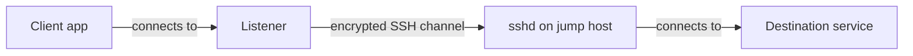

# SSH tunneling explanation: what port forwarding really does

## Summary (1-2 paragraphs)

SSH tunneling (port forwarding) creates an encrypted TCP path that makes a service reachable from a different network location than it normally would be. The key idea is that an SSH tunnel changes where a connection originates from, by relaying traffic through an SSH server that can reach the destination. This is why tunnels are powerful for accessing internal services through a bastion.

The same power is the risk: a tunnel can bypass normal ingress controls and unintentionally expose sensitive services if you bind forwarded ports too broadly. Understanding which side binds the listening port, which side resolves the destination, and who can reach the bound port is the core mental model.

## Context

### Problem statement

- You need temporary access to internal services without permanently opening firewall rules.
- You need a secure channel across untrusted networks.

### Constraints

- **Security constraints:** tunnels can create unexpected exposure; binds must be intentional.
- **Operational constraints:** multiple hops and many forwarded ports can get confusing quickly.
- **Process constraints:** some environments forbid ad-hoc tunnels in favor of managed access.

## Concepts and mental model

### Key terms

- **Listener/bind:** the address/port that accepts connections (`127.0.0.1:15432`).
- **Destination:** the host/port the tunnel connects to (`db.internal:5432`).
- **Jump host/bastion:** the SSH server you connect to.
- **Client vs server:** which machine runs `ssh` vs which machine runs `sshd`.

### How it works (high level)

When you run a forward, SSH does two things:

1. Opens a listener on one side (local for `-L`, remote for `-R`).
2. For each inbound connection to that listener, opens an outbound connection to the destination on the other side (through the encrypted SSH channel).

## Architecture

### Components

| Component | Responsibility | Owner | Notes |
|---|---|---|---|
| `ssh` client | creates listener + relays | workstation user | where you run the command |
| `sshd` server | accepts SSH + enforces policy | host owner | controls whether forwarding is allowed |
| destination service | receives final connection | service owner | often sees traffic as coming from jump host |

### Data flow (detailed)

#### Local forward (-L)

1. Your workstation binds `127.0.0.1:<local_port>`.
2. Your app connects to that local port.
3. `ssh` relays the stream through the SSH channel to the jump host.
4. The jump host opens a TCP connection to `<target_host>:<target_port>`.

Important consequence:

- `<target_host>` is resolved and reached from the jump host network, not yours.

#### Remote forward (-R)

1. The remote side binds `127.0.0.1:<remote_port>` (or other bind if allowed).
2. A process on the remote side connects to that port.
3. Traffic is relayed back through the SSH channel.
4. Your side opens a TCP connection to the specified destination (often localhost on your workstation).

Important consequence:

- Remote forwards can create new ingress paths on the remote side.

#### Dynamic forward (-D)

1. Your workstation binds a SOCKS proxy port (e.g., `127.0.0.1:1080`).
2. The application asks the SOCKS proxy to connect to arbitrary destinations.
3. Those connections are made from the jump host network.

Important consequence:

- A SOCKS proxy can be broader in scope than a single `-L` forward; configure per-app.

## Tradeoffs and decisions

### What we optimized for

- Secure, temporary access without permanent network changes.
- Flexibility across many protocols that run over TCP.

### What we accepted

- Easy to misuse bind addresses and expose sensitive services.
- Debugging requires thinking about two networks (your side and jump host side).

### Alternatives considered

| Alternative | Pros | Cons | Why not chosen |
|---|---|---|---|
| VPN / Zero Trust | managed policy + auditing | requires platform | may not be available for quick access |
| application proxy | protocol-aware, safer defaults | setup overhead | not always available |

## Security model

### Threats

- Exposing a forwarded port to unintended clients (binding to `0.0.0.0`).
- Using tunnels to bypass intended access controls.
- Credential leakage through tools/proxies using the tunnel.

### Controls

- Bind to `127.0.0.1` unless explicitly approved otherwise.
- Prefer `-L` (local) to `-R` (remote) for least exposure.
- Use server policies (`AllowTcpForwarding`, `PermitOpen`, etc.) where applicable.

### Failure impact

- A misbound tunnel can turn an internal admin port into a reachable network service.

## Operational behavior

### Failure modes

| Failure mode | Symptoms | Detection | Mitigation |
|---|---|---|---|
| wrong destination | tunnel up, app fails | `ssh -v`, verify from jump host | validate connectivity from jump host |
| wrong bind scope | unexpected clients can connect | unexpected traffic | rebind to loopback, stop process |
| server policy blocks | forward fails | SSH errors | use allowed bind or request change |

### Scaling and performance

- Tunnels relay traffic; high throughput can add load and latency on the jump host.
- Prefer managed connectivity for sustained long-lived access.

### Backup / restore / DR

- Tunnels are ephemeral; the "backup" is documenting the intent and command.

## Best Practices

These are principles and guardrails (not a procedure).

- Ask two questions: "Where is the listener bound?" and "From where is the destination reached?"
- Default to loopback binds; assume broader binds increase exposure.
- Prefer short-lived tunnels with explicit owners and shutdown times.
- Use managed connectivity for long-lived access patterns.

## FAQ

**Q:** Why does the destination see traffic coming from the jump host?  
**A:** Because the jump host typically makes the final TCP connection to the destination for `-L` and `-D`.

**Q:** Why is `-R 0.0.0.0:<port>...` blocked sometimes?  
**A:** Many servers restrict non-loopback remote binds to prevent accidental exposure.

## Further reading

- Tutorial: `ops-scripts/documentation/01-tutorial/ssh-tunneling-getting-started.md`
- How-to: `ops-scripts/documentation/02-how-to-guide/ssh-tunneling-operate-safely.md`
- Reference: `ops-scripts/documentation/03-reference/ssh-tunneling-reference.md`

